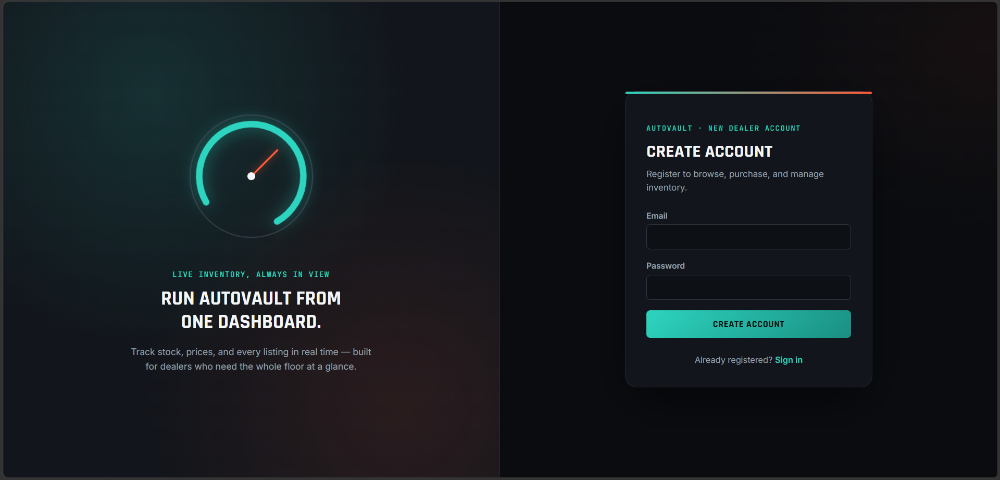
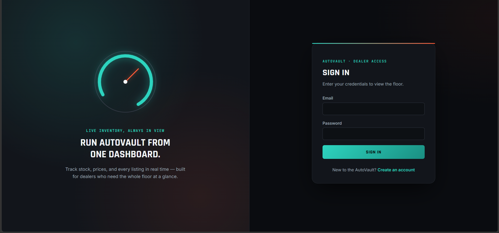
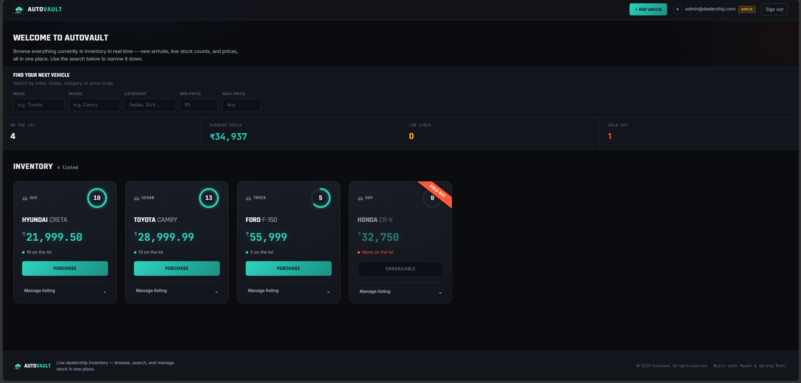
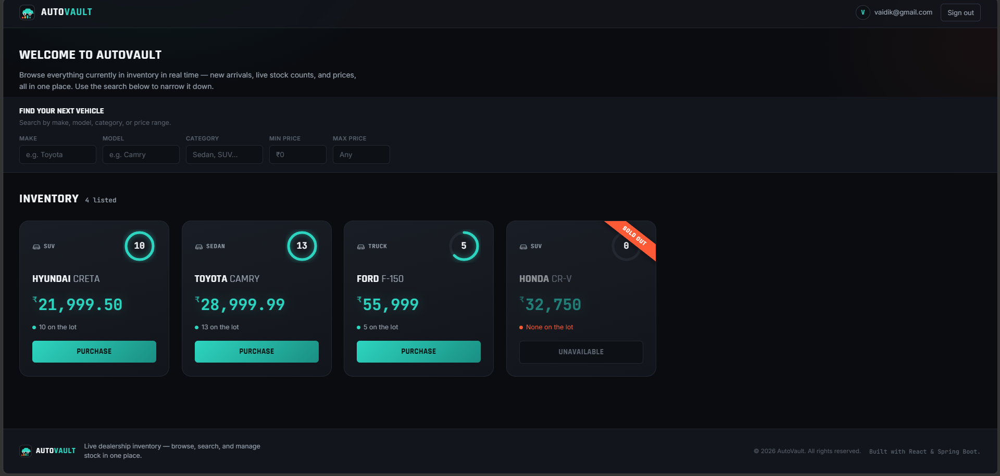
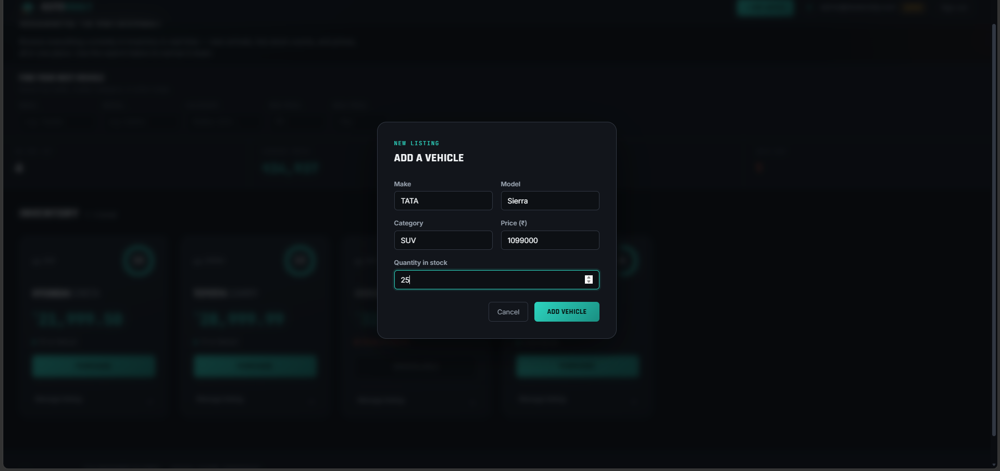
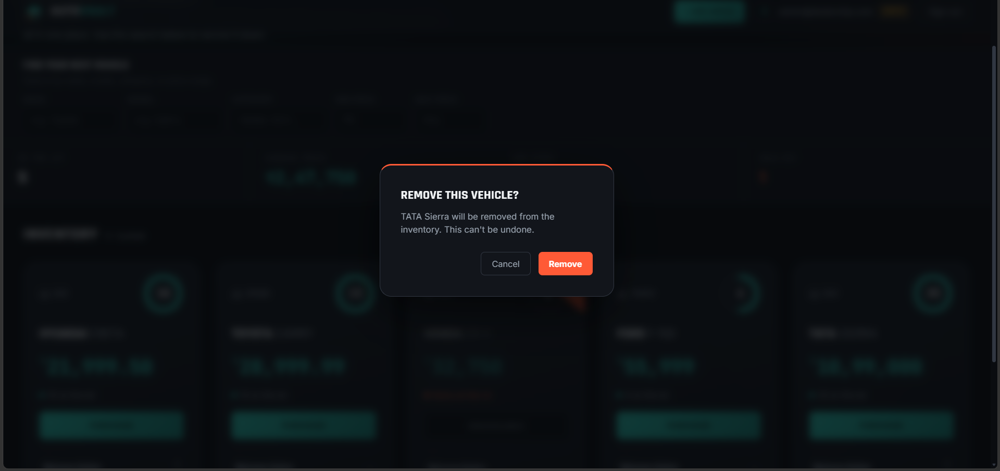

# 🚗 AutoVault — Car Dealership Inventory System

A full-stack **Car Dealership Inventory System** built as a TDD kata. The backend is a production-grade REST API built with **Spring Boot 3**, **PostgreSQL**, **Flyway**, and **JWT authentication**. The frontend, **AutoVault**, is a **React (Vite)** single-page app styled as a dark instrument cluster — vehicles are presented as gauge-style cards, prices are shown in ₹ (INR), and stock levels glow teal/amber/red the way a dashboard telltale would.

---

## Table of Contents

- [Architecture Overview](#architecture-overview)
- [Tech Stack](#tech-stack)
- [API Reference](#api-reference)
- [Local Setup](#local-setup)
- [Running Tests](#running-tests)
- [Environment Variables](#environment-variables)
- [Frontend](#frontend)
- [Screenshots](#screenshots)
- [TDD Commit History](#tdd-commit-history)
- [My AI Usage](#my-ai-usage)

---

## Architecture Overview

```
┌──────────────┐     JWT      ┌─────────────────────────────────┐
│   Frontend   │ ──Bearer──▶  │  Spring Boot API  (port 8080)   │
│   (React)    │              │                                  │
└──────────────┘              │  AuthController  /api/auth/**   │
                              │  VehicleController /api/vehicles│
                              └────────────┬────────────────────┘
                                           │  JPA + Flyway
                                           ▼
                              ┌─────────────────────────────────┐
                              │   PostgreSQL 16  (port 5433)    │
                              │   users | vehicles              │
                              │   flyway_schema_history         │
                              └─────────────────────────────────┘
```

**Security flow:** Every request passes through `JwtAuthFilter` → extracts the Bearer token → validates it via `JwtService` → populates `SecurityContext` → route-level rules in `SecurityConfig` decide whether the authenticated principal may proceed.

---

## Tech Stack

| Layer | Technology |
|---|---|
| Language | Java 17 |
| Framework | Spring Boot 3.5 |
| Security | Spring Security 6 + JJWT 0.12 |
| Persistence | Spring Data JPA + Hibernate 6 |
| Migrations | Flyway 11 |
| Database | PostgreSQL 16 |
| Build | Maven (Maven Wrapper included) |
| Testing | JUnit 5, Mockito, Spring MockMvc |
| Containers | Docker + Docker Compose |

---

## API Reference

### Auth (public)

| Method | Path | Body | Response |
|---|---|---|---|
| `POST` | `/api/auth/register` | `{ email, password }` | `201` `{ token, email, role }` |
| `POST` | `/api/auth/login` | `{ email, password }` | `200` `{ token, email, role }` |

### Vehicles (requires `Authorization: Bearer <token>`)

| Method | Path | Auth | Body / Params | Response |
|---|---|---|---|---|
| `GET` | `/api/vehicles` | Any | — | `200` list |
| `GET` | `/api/vehicles/search` | Any | `?make=&model=&category=&minPrice=&maxPrice=` | `200` filtered list |
| `POST` | `/api/vehicles` | Any | `{ make, model, category, price, quantity }` | `201` vehicle |
| `PUT` | `/api/vehicles/{id}` | Any | `{ make, model, category, price, quantity }` | `200` vehicle |
| `DELETE` | `/api/vehicles/{id}` | **ADMIN** | — | `204` |
| `POST` | `/api/vehicles/{id}/purchase` | Any | — | `200` updated vehicle |
| `POST` | `/api/vehicles/{id}/restock` | **ADMIN** | `{ quantity }` | `200` updated vehicle |

> `price` is stored and returned as a plain decimal (currency-agnostic). The frontend formats it as ₹ (INR) with Indian digit grouping — see [`utils/currency.js`](frontend/src/utils/currency.js).

### Error responses

All errors follow a consistent shape:

```json
{
  "timestamp": "2026-07-11T10:00:00",
  "status": 409,
  "error": "Conflict",
  "message": "Insufficient stock for vehicle id 1: requested 1, available 0",
  "path": "/api/vehicles/1/purchase"
}
```

| Status | Trigger |
|---|---|
| `400` | Bean Validation failure |
| `401` | Wrong password on login |
| `403` | Missing token or insufficient role |
| `404` | Vehicle / user not found |
| `409` | Duplicate email on register, or zero stock on purchase |

---

## Local Setup

### Prerequisites

- Docker & Docker Compose
- Java 17+ (Eclipse Temurin / OpenJDK)
- Maven (or use the included `mvnw` wrapper)

### 1. Start the database

```bash
docker-compose up -d
```

This starts PostgreSQL 16 on **port 5433** (non-default to avoid clashing with a local install).

### 2. Run the backend

```bash
cd backend
./mvnw spring-boot:run        # Linux/macOS
.\mvnw.cmd spring-boot:run    # Windows PowerShell
```

Flyway automatically runs all three migrations on first boot:

| Migration | What it does |
|---|---|
| `V1__create_users_table.sql` | Creates `users` table |
| `V2__create_vehicles_table.sql` | Creates `vehicles` table |
| `V3__seed_admin_user.sql` | Seeds an admin account |

**Seeded admin credentials:**

| Field | Value |
|---|---|
| Email | `admin@dealership.com` |
| Password | `Admin@1234` |

### 3. Verify it works

```bash
# Register
curl -s -X POST http://localhost:8080/api/auth/register \
  -H "Content-Type: application/json" \
  -d '{"email":"user@test.com","password":"password123"}' | jq

# Login — copy the token
curl -s -X POST http://localhost:8080/api/auth/login \
  -H "Content-Type: application/json" \
  -d '{"email":"admin@dealership.com","password":"Admin@1234"}' | jq
```

---

## Running Tests

Unit and slice tests run **without a database** (all DB interactions are mocked):

```bash
cd backend
./mvnw test                   # Linux/macOS
.\mvnw.cmd test               # Windows PowerShell
```

**Test suite breakdown:**

| Test class | Type | Tests |
|---|---|---|
| `AuthServiceTest` | Unit (Mockito) | 4 |
| `AuthControllerTest` | Web slice (@WebMvcTest) | 2 |
| `VehicleServiceTest` | Unit (Mockito) | 6 |
| `VehicleControllerTest` | Web slice (@WebMvcTest) | 3 |
| **Total** | | **15** |

The default `InventoryApplicationTests` context test is `@Disabled` because it requires a live PostgreSQL connection. To run it manually:

```bash
docker-compose up -d
./mvnw test -Dtest=InventoryApplicationTests
```

---

## Environment Variables

All sensitive values are externalised via env vars with local dev defaults:

| Variable | Default | Description |
|---|---|---|
| `DB_URL` | `jdbc:postgresql://localhost:5433/dealership` | JDBC connection string |
| `DB_USER` | `dealership_user` | Database username |
| `DB_PASS` | `dealership_pass` | Database password |
| `JWT_SECRET` | *(dev key — see application.yml)* | Base64-encoded 256-bit HMAC-SHA256 key |
| `JWT_EXPIRATION_MS` | `3600000` | Token TTL in milliseconds (1 hour) |
| `PORT` | `8080` | HTTP server port |

**Generate a production JWT secret:**

```bash
openssl rand -base64 32
```

---

## Frontend

### Tech stack

| Layer | Technology |
|---|---|
| Framework | React 19 + Vite |
| Routing | React Router v7 |
| HTTP client | Axios (with a JWT request interceptor + 401 redirect) |
| Forms | React Hook Form |
| Auth state | React Context (`AuthContext`), token decoded client-side via `jwt-decode` |
| Styling | Plain CSS with a token system (`styles/tokens.css`) — no UI framework |

### Design concept

The dashboard is built around the "instrument cluster" of a car — a dark cockpit fascia, glowing HUD digits, and gauge needles, rather than a generic dark SaaS theme. Each vehicle card carries a circular **stock gauge** (an SVG ring, exactly like a fuel or RPM gauge) that fills and changes color with quantity on hand: teal when healthy, amber when low (≤2 left), red when sold out — the same three-color language used sitewide (search, stats, alerts). Prices are shown in **₹ (INR)** with Indian digit grouping. The **AutoVault** brand mark pairs a small car silhouette with a four-bar "stock levels" strip underneath it, so the logo itself reads as *car + inventory* rather than an abstract icon.

The stats console (total on the lot, average price, low-stock count, sold-out count) is shown to **admins only** — regular signed-in users see the intro copy, the search bar, and the inventory grid without the operational numbers. Out-of-stock vehicles also get a diagonal "Sold out" ribbon on the card itself, so unavailability reads visually and not just through a disabled button.

Fonts: **Rajdhani** (condensed, for headings and the brand wordmark — reads like dashboard/HUD lettering), **Inter** (body text), **JetBrains Mono** (prices, stock counts, and gauge digits).

### Project structure

```
frontend/src/
├── api/axiosInstance.js        # JWT interceptor, public-route whitelist, 401 handling
├── context/
│   ├── authContextInstance.js  # AuthContext (split out for Fast Refresh compliance)
│   ├── AuthContext.jsx         # AuthProvider — login/register/logout, isAdmin
│   ├── toastContextInstance.js
│   └── ToastContext.jsx        # ToastProvider — lightweight notification queue
├── hooks/useAuth.js, useToast.js
├── routes/ProtectedRoute.jsx   # redirects unauthenticated users to /login
├── utils/
│   ├── currency.js             # shared ₹ (INR) price formatter, Indian digit grouping
│   └── tokenStore.js
├── components/
│   ├── Navbar.jsx              # brand mark + AutoVault wordmark, add-vehicle (admin), user chip, sign out
│   ├── BrandMark.jsx           # shared logo (car silhouette + inventory bar strip), used in Navbar & Footer
│   ├── Footer.jsx              # site footer — brand, tagline, copyright
│   ├── SearchFilterBar.jsx     # intro copy + make/model/category/price-range search
│   ├── VehicleCard.jsx         # gauge-style stock ring, ₹ price, purchase, admin edit/restock/delete
│   ├── VehicleFormModal.jsx    # add/edit form (react-hook-form)
│   ├── ConfirmDialog.jsx       # delete confirmation (no window.confirm)
│   ├── EmptyState.jsx          # empty lot / no search results
│   ├── Spinner.jsx             # first-load spinner only — filtered refetches dim the grid instead
│   └── Toast.jsx               # notification stack
├── pages/
│   ├── LoginPage.jsx, RegisterPage.jsx, AuthPage.css
│   └── DashboardPage.jsx, DashboardPage.css
├── styles/tokens.css, global.css
└── App.jsx, main.jsx
```

### Run it

```bash
cd frontend
npm install
npm run dev
```

Opens on `http://localhost:5173` by default. `VITE_API_BASE_URL` in `frontend/.env` points it at the backend (`http://localhost:8080/api`) — start the backend first.

### What each role sees

| Feature | Any signed-in user | Admin |
|---|---|---|
| View & search inventory | ✅ | ✅ |
| Purchase a vehicle (disabled at 0 stock) | ✅ | ✅ |
| Add, Edit, Delete, Restock a vehicle | ❌ | ✅ |

Role is read from the `role` claim already present in the JWT (see `JwtService`), so no extra API call is needed to know whether to show admin controls. **The backend enforces this independently** (`SecurityConfig` + `@PreAuthorize`) — the frontend check is for UX only, not the actual security boundary.

---

## Screenshots

<h3>Authentication</h3>

<p align="center">
  
  
</p>

<h3>Dashboard</h3>

<p align="center">
  
  
</p>

<h3>Inventory Management</h3>

<p align="center">
  
  
</p>

---

## TDD Commit History

The backend was built with a visible Red → Green → Refactor pattern for the two areas with real business logic:

| Commit | Stage | What it covers |
|---|---|---|
| `test: add failing tests for auth registration and login (RED)` | RED | `AuthServiceTest` written against `AuthService`/`JwtService`, which didn't exist yet |
| `feat: implement JwtService and AuthService to pass auth tests (GREEN)` | GREEN | Token generation/validation, register/login logic |
| `test: add failing tests for AuthServiceTest, AuthControllerTest, and VehicleServiceTest (RED)` | RED | Locks in the register/login contract and the vehicle service contract before either production class exists |
| `feat(vehicle): implement service, API layer, and seed admin user (GREEN)` | GREEN | `VehicleService` (including pessimistic-locked purchase/restock), `VehicleController`, admin seed data |

Full history is visible in `git log` on the repository — each commit is scoped to one coherent unit of work rather than one file, so the log reads as a build narrative rather than a file-by-file diff dump.

---

## My AI Usage

**Tools used:** Claude (Anthropic), used throughout both the backend and frontend build.

**How I used it:**

- **Boilerplate generation** — entity classes, DTOs with Bean Validation annotations, and the repetitive parts of `GlobalExceptionHandler` were drafted by Claude and reviewed/adjusted by me (e.g. confirming the exception-to-HTTP-status mapping matched what the spec actually required).
- **Test-first scaffolding** — for both `AuthServiceTest` and `VehicleServiceTest`, I asked Claude to draft the failing test cases first (the RED step), then had it implement the corresponding service to pass them (GREEN). I reviewed each test for whether it actually asserted the right thing before treating it as "locked in" — a couple of early drafts asserted on mock invocation counts rather than the actual response shape, which I corrected.
- **Frontend components** — the frontend (design of all components, styling) was drafted by Claude in one pass based on my description of the visual direction I wanted (an "instrument cluster" theme grounded in the actual dealership subject matter — gauges, HUD digits, dashboard telltale colors — rather than a generic admin dashboard). 
- **Debugging** — when Spring failed to start because no `PasswordEncoder` bean existed for `AuthServiceImpl` to inject, I described the stack trace to Claude and it identified the missing `@Bean` declaration in `SecurityConfig`.

**Reflection:** AI meaningfully sped up the boilerplate-heavy parts of this build — DTOs, repetitive test setup, and CSS for a design system all would have taken multiples longer to hand-write. It did not replace the judgment calls: deciding *which* HTTP status maps to which exception, confirming the pessimistic-locking approach was actually the right tool for the purchase/restock race condition (rather than just accepting a plausible-sounding suggestion), and manually verifying the security rules actually blocked what they claimed to block were all things I had to check myself rather than trust outright. The biggest risk I noticed with AI-assisted development is that generated code *looks* finished even when it hasn't been verified — so my working rule was: nothing gets committed as "done" until I've either run it against the real database or exercised it through a slice test myself.